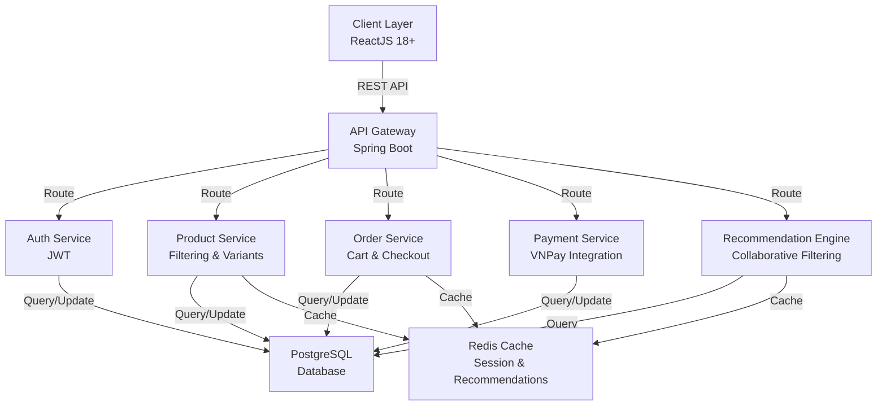
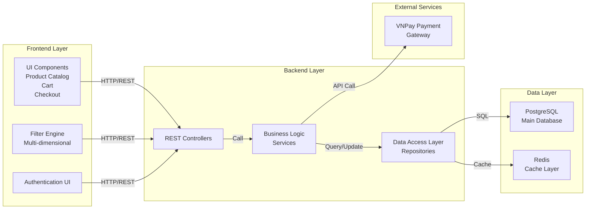
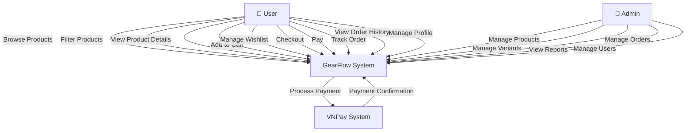
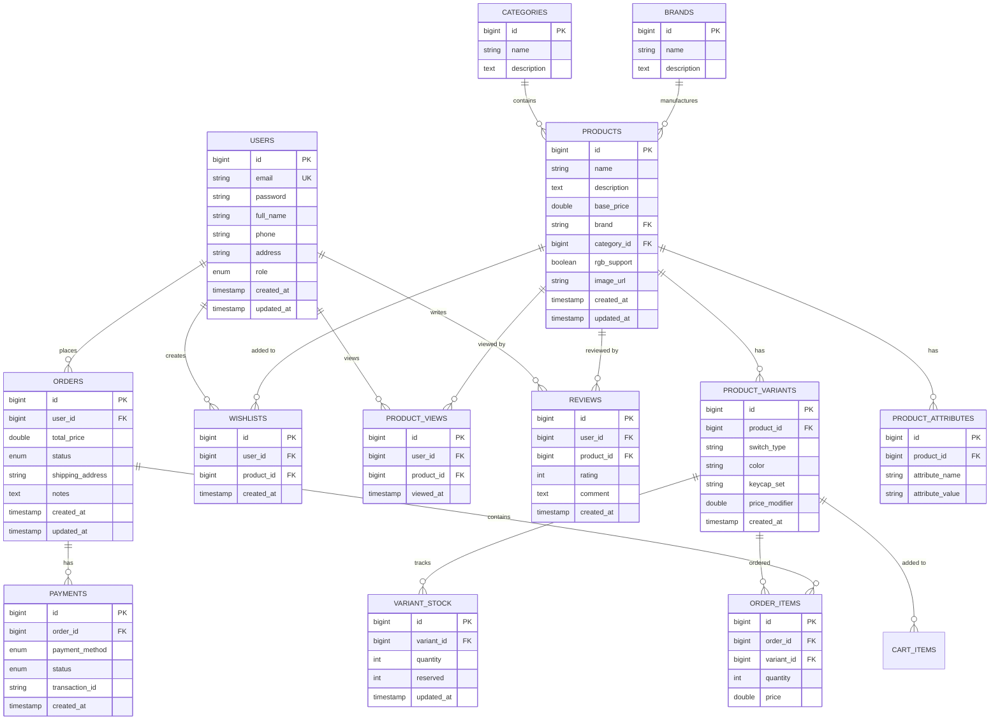
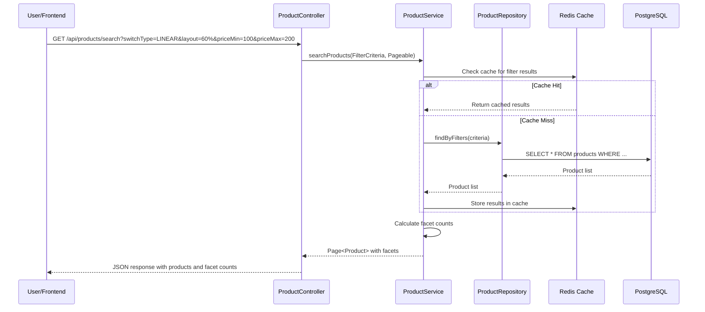
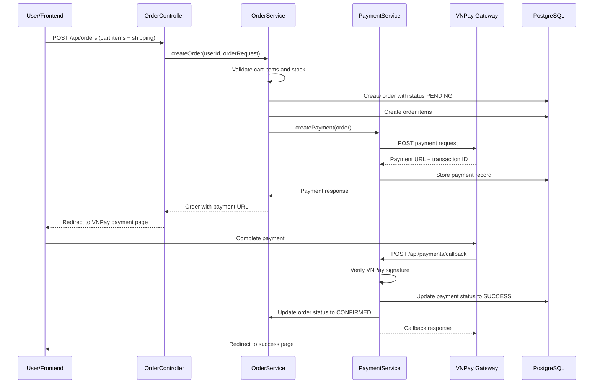
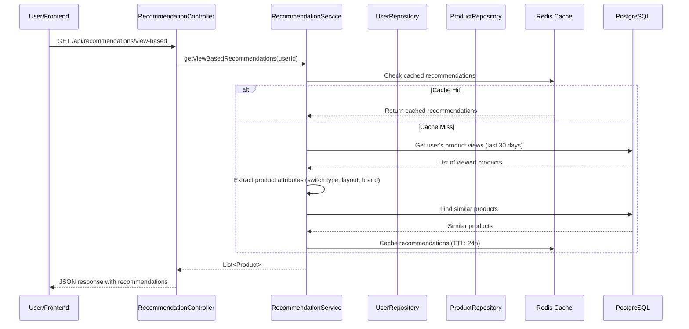
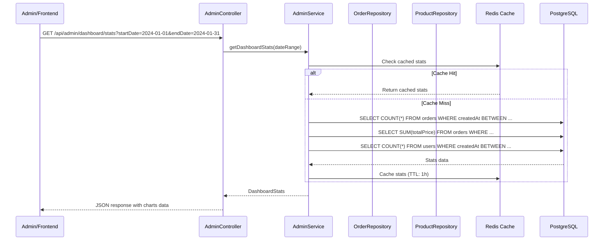

# Design Document: GearFlow Keyboard E-commerce System

## Overview

GearFlow là một hệ thống thương mại điện tử chuyên biệt cho bàn phím cơ, tích hợp bộ lọc thuộc tính đa chiều, quản lý biến thể sản phẩm, hệ thống gợi ý cá nhân hóa, và thanh toán trực tuyến qua VNPay. Hệ thống được xây dựng trên kiến trúc Client-Server với Spring Boot 3.x backend, ReactJS 18+ frontend, và PostgreSQL database, hỗ trợ mở rộng sang Microservices.

## Architecture

### System Architecture Diagram



### High-Level Component Diagram




## Use Case Diagram



## Entity Relationship Diagram (ERD)




## Components and Interfaces

### 1. Authentication Service

**Purpose**: Xác thực người dùng, quản lý JWT tokens, và phân quyền

**Interface**:
```java
interface AuthenticationService {
  AuthResponse login(LoginRequest request): AuthResponse
  AuthResponse register(RegisterRequest request): AuthResponse
  AuthResponse refreshToken(String refreshToken): AuthResponse
  void logout(String token): void
  User validateToken(String token): User
  boolean hasRole(User user, String role): boolean
}

interface AuthController {
  POST /api/auth/login
  POST /api/auth/register
  POST /api/auth/refresh
  POST /api/auth/logout
  GET /api/auth/me
}
```

**Responsibilities**:
- Xác thực thông tin đăng nhập
- Tạo và quản lý JWT tokens
- Xác thực tokens trong các request
- Quản lý phiên làm việc

### 2. Product Service

**Purpose**: Quản lý sản phẩm, biến thể, và bộ lọc đa chiều

**Interface**:
```java
interface ProductService {
  Page<Product> searchProducts(FilterCriteria criteria, Pageable pageable): Page<Product>
  Product getProductById(Long id): Product
  List<ProductVariant> getVariants(Long productId): List<ProductVariant>
  ProductVariant getVariantById(Long variantId): ProductVariant
  List<FacetCount> getFacetCounts(FilterCriteria criteria): List<FacetCount>
  List<Product> getRecommendations(Long userId): List<Product>
}

interface ProductController {
  GET /api/products/search
  GET /api/products/{id}
  GET /api/products/{id}/variants
  GET /api/products/facets
  GET /api/products/recommendations
  POST /api/products (Admin)
  PUT /api/products/{id} (Admin)
  DELETE /api/products/{id} (Admin)
}
```

**Responsibilities**:
- Tìm kiếm sản phẩm với bộ lọc đa chiều
- Quản lý biến thể sản phẩm
- Cập nhật stock
- Tính toán facet counts cho bộ lọc

### 3. Cart Service

**Purpose**: Quản lý giỏ hàng người dùng

**Interface**:
```java
interface CartService {
  Cart getCart(Long userId): Cart
  Cart addItem(Long userId, Long variantId, int quantity): Cart
  Cart removeItem(Long userId, Long cartItemId): Cart
  Cart updateItemQuantity(Long userId, Long cartItemId, int quantity): Cart
  void clearCart(Long userId): void
  CartSummary getCartSummary(Long userId): CartSummary
}

interface CartController {
  GET /api/cart
  POST /api/cart/items
  DELETE /api/cart/items/{itemId}
  PUT /api/cart/items/{itemId}
  DELETE /api/cart
}
```

**Responsibilities**:
- Thêm/xóa/cập nhật sản phẩm trong giỏ
- Tính toán tổng giá
- Kiểm tra stock
- Lưu trữ giỏ hàng (session/cache)

### 4. Order Service

**Purpose**: Quản lý đơn hàng và quy trình checkout

**Interface**:
```java
interface OrderService {
  Order createOrder(Long userId, OrderRequest request): Order
  Order getOrder(Long orderId): Order
  Page<Order> getUserOrders(Long userId, Pageable pageable): Page<Order>
  Order updateOrderStatus(Long orderId, OrderStatus status): Order
  List<Order> getOrdersByStatus(OrderStatus status): List<Order>
}

interface OrderController {
  POST /api/orders
  GET /api/orders/{id}
  GET /api/orders
  PUT /api/orders/{id}/status
  GET /api/orders/admin/pending
}
```

**Responsibilities**:
- Tạo đơn hàng từ giỏ hàng
- Quản lý trạng thái đơn hàng
- Xác nhận thanh toán
- Theo dõi đơn hàng

### 5. Payment Service

**Purpose**: Tích hợp VNPay và quản lý thanh toán

**Interface**:
```java
interface PaymentService {
  PaymentResponse createPayment(Order order): PaymentResponse
  PaymentResponse verifyPayment(String transactionId, String responseCode): PaymentResponse
  Payment getPaymentStatus(String transactionId): Payment
  void processPaymentCallback(VNPayCallback callback): void
}

interface PaymentController {
  POST /api/payments/create
  GET /api/payments/callback
  GET /api/payments/{transactionId}/status
}
```

**Responsibilities**:
- Tạo request thanh toán VNPay
- Xác minh kết quả thanh toán
- Cập nhật trạng thái thanh toán
- Xử lý callback từ VNPay

### 6. Recommendation Service

**Purpose**: Gợi ý sản phẩm cá nhân hóa

**Interface**:
```java
interface RecommendationService {
  List<Product> getViewBasedRecommendations(Long userId, int limit): List<Product>
  List<Product> getPurchaseBasedRecommendations(Long userId, int limit): List<Product>
  List<Product> getCollaborativeRecommendations(Long userId, int limit): List<Product>
  List<Product> getAccessoryRecommendations(Long productId, int limit): List<Product>
  void recordProductView(Long userId, Long productId): void
}

interface RecommendationController {
  GET /api/recommendations/view-based
  GET /api/recommendations/purchase-based
  GET /api/recommendations/collaborative
  GET /api/products/{id}/accessories
  POST /api/products/{id}/view
}
```

**Responsibilities**:
- Ghi nhận lịch sử xem sản phẩm
- Ghi nhận lịch sử mua hàng
- Tính toán gợi ý dựa trên collaborative filtering
- Gợi ý phụ kiện liên quan

### 7. User Service

**Purpose**: Quản lý tài khoản người dùng

**Interface**:
```java
interface UserService {
  User getUserById(Long id): User
  User updateProfile(Long userId, UpdateProfileRequest request): User
  List<Wishlist> getWishlist(Long userId): List<Wishlist>
  void addToWishlist(Long userId, Long productId): void
  void removeFromWishlist(Long userId, Long productId): void
  Page<Review> getUserReviews(Long userId, Pageable pageable): Page<Review>
}

interface UserController {
  GET /api/users/{id}
  PUT /api/users/{id}
  GET /api/users/{id}/wishlist
  POST /api/users/{id}/wishlist/{productId}
  DELETE /api/users/{id}/wishlist/{productId}
  GET /api/users/{id}/reviews
}
```

**Responsibilities**:
- Quản lý thông tin cá nhân
- Quản lý danh sách yêu thích
- Quản lý đánh giá sản phẩm
- Lịch sử mua hàng

### 8. Admin Service

**Purpose**: Quản lý hệ thống cho admin

**Interface**:
```java
interface AdminService {
  Page<Product> getAllProducts(Pageable pageable): Page<Product>
  Product createProduct(CreateProductRequest request): Product
  Product updateProduct(Long id, UpdateProductRequest request): Product
  void deleteProduct(Long id): void
  Page<Order> getAllOrders(Pageable pageable): Page<Order>
  DashboardStats getDashboardStats(DateRange range): DashboardStats
  List<TopProduct> getTopProducts(int limit): List<TopProduct>
  List<SalesReport> getSalesReport(DateRange range): List<SalesReport>
}

interface AdminController {
  GET /api/admin/products
  POST /api/admin/products
  PUT /api/admin/products/{id}
  DELETE /api/admin/products/{id}
  GET /api/admin/orders
  GET /api/admin/dashboard/stats
  GET /api/admin/reports/top-products
  GET /api/admin/reports/sales
}
```

**Responsibilities**:
- CRUD sản phẩm và biến thể
- Quản lý đơn hàng
- Xem báo cáo doanh thu
- Quản lý người dùng


## Data Models

### User Model

```java
@Entity
@Table(name = "users")
public class User {
  @Id
  @GeneratedValue(strategy = GenerationType.IDENTITY)
  private Long id;
  
  @Column(unique = true, nullable = false)
  private String email;
  
  @Column(nullable = false)
  private String password;
  
  @Column(nullable = false)
  private String fullName;
  
  @Column(nullable = false)
  private String phone;
  
  private String address;
  
  @Enumerated(EnumType.STRING)
  private UserRole role;
  
  @CreationTimestamp
  private LocalDateTime createdAt;
  
  @UpdateTimestamp
  private LocalDateTime updatedAt;
  
  @OneToMany(mappedBy = "user", cascade = CascadeType.ALL)
  private List<Order> orders;
  
  @OneToMany(mappedBy = "user", cascade = CascadeType.ALL)
  private List<Wishlist> wishlists;
}

enum UserRole {
  USER, ADMIN
}
```

**Validation Rules**:
- Email phải hợp lệ và duy nhất
- Password tối thiểu 8 ký tự
- Phone phải là số hợp lệ
- Full name không được trống

### Product Model

```java
@Entity
@Table(name = "products")
public class Product {
  @Id
  @GeneratedValue(strategy = GenerationType.IDENTITY)
  private Long id;
  
  @Column(nullable = false)
  private String name;
  
  @Column(columnDefinition = "TEXT")
  private String description;
  
  @Column(nullable = false)
  private Double basePrice;
  
  @ManyToOne
  @JoinColumn(name = "brand_id")
  private Brand brand;
  
  @ManyToOne
  @JoinColumn(name = "category_id")
  private Category category;
  
  private Boolean rgbSupport;
  
  private String imageUrl;
  
  @OneToMany(mappedBy = "product", cascade = CascadeType.ALL)
  private List<ProductVariant> variants;
  
  @OneToMany(mappedBy = "product", cascade = CascadeType.ALL)
  private List<ProductAttribute> attributes;
  
  @CreationTimestamp
  private LocalDateTime createdAt;
  
  @UpdateTimestamp
  private LocalDateTime updatedAt;
}
```

**Validation Rules**:
- Name không được trống
- Base price > 0
- Category phải tồn tại
- Brand phải tồn tại

### ProductVariant Model

```java
@Entity
@Table(name = "product_variants")
public class ProductVariant {
  @Id
  @GeneratedValue(strategy = GenerationType.IDENTITY)
  private Long id;
  
  @ManyToOne
  @JoinColumn(name = "product_id", nullable = false)
  private Product product;
  
  @Enumerated(EnumType.STRING)
  private SwitchType switchType;
  
  private String color;
  
  private String keycapSet;
  
  private Double priceModifier;
  
  @OneToOne(mappedBy = "variant", cascade = CascadeType.ALL)
  private VariantStock stock;
  
  @CreationTimestamp
  private LocalDateTime createdAt;
}

enum SwitchType {
  LINEAR, TACTILE, CLICKY
}
```

**Validation Rules**:
- Switch type phải hợp lệ
- Price modifier có thể âm hoặc dương
- Stock phải >= 0

### Order Model

```java
@Entity
@Table(name = "orders")
public class Order {
  @Id
  @GeneratedValue(strategy = GenerationType.IDENTITY)
  private Long id;
  
  @ManyToOne
  @JoinColumn(name = "user_id", nullable = false)
  private User user;
  
  @Column(nullable = false)
  private Double totalPrice;
  
  @Enumerated(EnumType.STRING)
  private OrderStatus status;
  
  @Column(nullable = false)
  private String shippingAddress;
  
  private String notes;
  
  @OneToMany(mappedBy = "order", cascade = CascadeType.ALL)
  private List<OrderItem> items;
  
  @OneToOne(mappedBy = "order", cascade = CascadeType.ALL)
  private Payment payment;
  
  @CreationTimestamp
  private LocalDateTime createdAt;
  
  @UpdateTimestamp
  private LocalDateTime updatedAt;
}

enum OrderStatus {
  PENDING, CONFIRMED, SHIPPED, DELIVERED, CANCELLED
}
```

**Validation Rules**:
- Total price > 0
- Shipping address không được trống
- Status phải hợp lệ
- Phải có ít nhất 1 order item

### Payment Model

```java
@Entity
@Table(name = "payments")
public class Payment {
  @Id
  @GeneratedValue(strategy = GenerationType.IDENTITY)
  private Long id;
  
  @OneToOne
  @JoinColumn(name = "order_id", nullable = false)
  private Order order;
  
  @Enumerated(EnumType.STRING)
  private PaymentMethod paymentMethod;
  
  @Enumerated(EnumType.STRING)
  private PaymentStatus status;
  
  @Column(unique = true)
  private String transactionId;
  
  private Double amount;
  
  @CreationTimestamp
  private LocalDateTime createdAt;
  
  @UpdateTimestamp
  private LocalDateTime updatedAt;
}

enum PaymentMethod {
  VNPAY, CREDIT_CARD, BANK_TRANSFER
}

enum PaymentStatus {
  PENDING, SUCCESS, FAILED, CANCELLED
}
```

**Validation Rules**:
- Transaction ID phải duy nhất
- Amount > 0
- Status phải hợp lệ


## Sequence Diagrams

### Product Search with Multi-dimensional Filtering



### Checkout and Payment Flow



### Recommendation Engine Flow



### Admin Dashboard Report Generation




## API Endpoints Specification

### Authentication Endpoints

```
POST /api/auth/login
  Request: { email: string, password: string }
  Response: { accessToken: string, refreshToken: string, user: User }
  Status: 200 OK, 401 Unauthorized

POST /api/auth/register
  Request: { email: string, password: string, fullName: string, phone: string }
  Response: { id: long, email: string, fullName: string }
  Status: 201 Created, 400 Bad Request

POST /api/auth/refresh
  Request: { refreshToken: string }
  Response: { accessToken: string, refreshToken: string }
  Status: 200 OK, 401 Unauthorized

POST /api/auth/logout
  Headers: Authorization: Bearer {token}
  Response: { message: string }
  Status: 200 OK

GET /api/auth/me
  Headers: Authorization: Bearer {token}
  Response: User object
  Status: 200 OK, 401 Unauthorized
```

### Product Endpoints

```
GET /api/products/search
  Query: switchType, layout, brand, priceMin, priceMax, connectionType, rgbSupport, page, size
  Response: { content: Product[], totalElements: long, totalPages: int, facets: Facet[] }
  Status: 200 OK

GET /api/products/{id}
  Response: Product with variants and attributes
  Status: 200 OK, 404 Not Found

GET /api/products/{id}/variants
  Response: List<ProductVariant>
  Status: 200 OK

GET /api/products/facets
  Query: switchType, layout, brand, priceMin, priceMax
  Response: { facets: { switchType: FacetCount[], layout: FacetCount[], ... } }
  Status: 200 OK

GET /api/recommendations/view-based
  Query: limit (default: 10)
  Headers: Authorization: Bearer {token}
  Response: List<Product>
  Status: 200 OK

GET /api/recommendations/purchase-based
  Query: limit (default: 10)
  Headers: Authorization: Bearer {token}
  Response: List<Product>
  Status: 200 OK

GET /api/products/{id}/accessories
  Query: limit (default: 5)
  Response: List<Product>
  Status: 200 OK

POST /api/products/{id}/view
  Headers: Authorization: Bearer {token}
  Response: { message: string }
  Status: 200 OK
```

### Cart Endpoints

```
GET /api/cart
  Headers: Authorization: Bearer {token}
  Response: { items: CartItem[], totalPrice: double, totalItems: int }
  Status: 200 OK

POST /api/cart/items
  Headers: Authorization: Bearer {token}
  Request: { variantId: long, quantity: int }
  Response: Cart object
  Status: 201 Created, 400 Bad Request

PUT /api/cart/items/{itemId}
  Headers: Authorization: Bearer {token}
  Request: { quantity: int }
  Response: Cart object
  Status: 200 OK

DELETE /api/cart/items/{itemId}
  Headers: Authorization: Bearer {token}
  Response: Cart object
  Status: 200 OK

DELETE /api/cart
  Headers: Authorization: Bearer {token}
  Response: { message: string }
  Status: 200 OK
```

### Order Endpoints

```
POST /api/orders
  Headers: Authorization: Bearer {token}
  Request: { shippingAddress: string, notes: string }
  Response: { orderId: long, paymentUrl: string }
  Status: 201 Created, 400 Bad Request

GET /api/orders/{id}
  Headers: Authorization: Bearer {token}
  Response: Order with items and payment status
  Status: 200 OK, 404 Not Found

GET /api/orders
  Headers: Authorization: Bearer {token}
  Query: page, size, status
  Response: { content: Order[], totalElements: long, totalPages: int }
  Status: 200 OK

PUT /api/orders/{id}/status
  Headers: Authorization: Bearer {token}
  Request: { status: OrderStatus }
  Response: Order object
  Status: 200 OK, 403 Forbidden
```

### Payment Endpoints

```
POST /api/payments/create
  Headers: Authorization: Bearer {token}
  Request: { orderId: long }
  Response: { paymentUrl: string, transactionId: string }
  Status: 201 Created

GET /api/payments/callback
  Query: vnp_ResponseCode, vnp_TransactionNo, vnp_Amount, vnp_SecureHash
  Response: HTML redirect page
  Status: 200 OK

GET /api/payments/{transactionId}/status
  Headers: Authorization: Bearer {token}
  Response: { status: PaymentStatus, amount: double }
  Status: 200 OK
```

### User Endpoints

```
GET /api/users/{id}
  Headers: Authorization: Bearer {token}
  Response: User object
  Status: 200 OK, 404 Not Found

PUT /api/users/{id}
  Headers: Authorization: Bearer {token}
  Request: { fullName: string, phone: string, address: string }
  Response: User object
  Status: 200 OK

GET /api/users/{id}/wishlist
  Headers: Authorization: Bearer {token}
  Response: List<Product>
  Status: 200 OK

POST /api/users/{id}/wishlist/{productId}
  Headers: Authorization: Bearer {token}
  Response: { message: string }
  Status: 201 Created

DELETE /api/users/{id}/wishlist/{productId}
  Headers: Authorization: Bearer {token}
  Response: { message: string }
  Status: 200 OK
```

### Admin Endpoints

```
GET /api/admin/products
  Headers: Authorization: Bearer {token}
  Query: page, size, search
  Response: { content: Product[], totalElements: long, totalPages: int }
  Status: 200 OK, 403 Forbidden

POST /api/admin/products
  Headers: Authorization: Bearer {token}
  Request: CreateProductRequest
  Response: Product object
  Status: 201 Created, 403 Forbidden

PUT /api/admin/products/{id}
  Headers: Authorization: Bearer {token}
  Request: UpdateProductRequest
  Response: Product object
  Status: 200 OK, 403 Forbidden

DELETE /api/admin/products/{id}
  Headers: Authorization: Bearer {token}
  Response: { message: string }
  Status: 200 OK, 403 Forbidden

GET /api/admin/orders
  Headers: Authorization: Bearer {token}
  Query: page, size, status
  Response: { content: Order[], totalElements: long, totalPages: int }
  Status: 200 OK, 403 Forbidden

GET /api/admin/dashboard/stats
  Headers: Authorization: Bearer {token}
  Query: startDate, endDate
  Response: DashboardStats
  Status: 200 OK, 403 Forbidden

GET /api/admin/reports/top-products
  Headers: Authorization: Bearer {token}
  Query: limit, startDate, endDate
  Response: List<TopProduct>
  Status: 200 OK, 403 Forbidden

GET /api/admin/reports/sales
  Headers: Authorization: Bearer {token}
  Query: startDate, endDate, groupBy (DAY, WEEK, MONTH)
  Response: List<SalesReport>
  Status: 200 OK, 403 Forbidden
```


## Database Schema

### Normalized PostgreSQL Schema

```sql
-- Users table
CREATE TABLE users (
    id BIGSERIAL PRIMARY KEY,
    email VARCHAR(255) UNIQUE NOT NULL,
    password VARCHAR(255) NOT NULL,
    full_name VARCHAR(255) NOT NULL,
    phone VARCHAR(20) NOT NULL,
    address VARCHAR(500),
    role VARCHAR(50) DEFAULT 'USER',
    created_at TIMESTAMP DEFAULT CURRENT_TIMESTAMP,
    updated_at TIMESTAMP DEFAULT CURRENT_TIMESTAMP
);

-- Categories table
CREATE TABLE categories (
    id BIGSERIAL PRIMARY KEY,
    name VARCHAR(255) NOT NULL,
    description TEXT,
    created_at TIMESTAMP DEFAULT CURRENT_TIMESTAMP
);

-- Brands table
CREATE TABLE brands (
    id BIGSERIAL PRIMARY KEY,
    name VARCHAR(255) NOT NULL UNIQUE,
    description TEXT,
    created_at TIMESTAMP DEFAULT CURRENT_TIMESTAMP
);

-- Products table
CREATE TABLE products (
    id BIGSERIAL PRIMARY KEY,
    name VARCHAR(255) NOT NULL,
    description TEXT,
    base_price DECIMAL(10, 2) NOT NULL,
    category_id BIGINT NOT NULL REFERENCES categories(id),
    brand_id BIGINT NOT NULL REFERENCES brands(id),
    rgb_support BOOLEAN DEFAULT FALSE,
    image_url VARCHAR(500),
    created_at TIMESTAMP DEFAULT CURRENT_TIMESTAMP,
    updated_at TIMESTAMP DEFAULT CURRENT_TIMESTAMP
);

-- Product attributes table (for filtering)
CREATE TABLE product_attributes (
    id BIGSERIAL PRIMARY KEY,
    product_id BIGINT NOT NULL REFERENCES products(id) ON DELETE CASCADE,
    attribute_name VARCHAR(100) NOT NULL,
    attribute_value VARCHAR(255) NOT NULL,
    created_at TIMESTAMP DEFAULT CURRENT_TIMESTAMP
);

-- Product variants table
CREATE TABLE product_variants (
    id BIGSERIAL PRIMARY KEY,
    product_id BIGINT NOT NULL REFERENCES products(id) ON DELETE CASCADE,
    switch_type VARCHAR(50),
    color VARCHAR(100),
    keycap_set VARCHAR(100),
    price_modifier DECIMAL(10, 2) DEFAULT 0,
    created_at TIMESTAMP DEFAULT CURRENT_TIMESTAMP
);

-- Variant stock table
CREATE TABLE variant_stock (
    id BIGSERIAL PRIMARY KEY,
    variant_id BIGINT NOT NULL UNIQUE REFERENCES product_variants(id) ON DELETE CASCADE,
    quantity INT NOT NULL DEFAULT 0,
    reserved INT NOT NULL DEFAULT 0,
    updated_at TIMESTAMP DEFAULT CURRENT_TIMESTAMP
);

-- Orders table
CREATE TABLE orders (
    id BIGSERIAL PRIMARY KEY,
    user_id BIGINT NOT NULL REFERENCES users(id),
    total_price DECIMAL(10, 2) NOT NULL,
    status VARCHAR(50) DEFAULT 'PENDING',
    shipping_address VARCHAR(500) NOT NULL,
    notes TEXT,
    created_at TIMESTAMP DEFAULT CURRENT_TIMESTAMP,
    updated_at TIMESTAMP DEFAULT CURRENT_TIMESTAMP
);

-- Order items table
CREATE TABLE order_items (
    id BIGSERIAL PRIMARY KEY,
    order_id BIGINT NOT NULL REFERENCES orders(id) ON DELETE CASCADE,
    variant_id BIGINT NOT NULL REFERENCES product_variants(id),
    quantity INT NOT NULL,
    price DECIMAL(10, 2) NOT NULL,
    created_at TIMESTAMP DEFAULT CURRENT_TIMESTAMP
);

-- Payments table
CREATE TABLE payments (
    id BIGSERIAL PRIMARY KEY,
    order_id BIGINT NOT NULL UNIQUE REFERENCES orders(id) ON DELETE CASCADE,
    payment_method VARCHAR(50) DEFAULT 'VNPAY',
    status VARCHAR(50) DEFAULT 'PENDING',
    transaction_id VARCHAR(255) UNIQUE,
    amount DECIMAL(10, 2) NOT NULL,
    created_at TIMESTAMP DEFAULT CURRENT_TIMESTAMP,
    updated_at TIMESTAMP DEFAULT CURRENT_TIMESTAMP
);

-- Wishlists table
CREATE TABLE wishlists (
    id BIGSERIAL PRIMARY KEY,
    user_id BIGINT NOT NULL REFERENCES users(id) ON DELETE CASCADE,
    product_id BIGINT NOT NULL REFERENCES products(id) ON DELETE CASCADE,
    created_at TIMESTAMP DEFAULT CURRENT_TIMESTAMP,
    UNIQUE(user_id, product_id)
);

-- Product views table (for recommendations)
CREATE TABLE product_views (
    id BIGSERIAL PRIMARY KEY,
    user_id BIGINT NOT NULL REFERENCES users(id) ON DELETE CASCADE,
    product_id BIGINT NOT NULL REFERENCES products(id) ON DELETE CASCADE,
    viewed_at TIMESTAMP DEFAULT CURRENT_TIMESTAMP
);

-- Reviews table
CREATE TABLE reviews (
    id BIGSERIAL PRIMARY KEY,
    user_id BIGINT NOT NULL REFERENCES users(id) ON DELETE CASCADE,
    product_id BIGINT NOT NULL REFERENCES products(id) ON DELETE CASCADE,
    rating INT NOT NULL CHECK (rating >= 1 AND rating <= 5),
    comment TEXT,
    created_at TIMESTAMP DEFAULT CURRENT_TIMESTAMP,
    UNIQUE(user_id, product_id)
);

-- Indexes for performance
CREATE INDEX idx_products_category ON products(category_id);
CREATE INDEX idx_products_brand ON products(brand_id);
CREATE INDEX idx_product_variants_product ON product_variants(product_id);
CREATE INDEX idx_variant_stock_variant ON variant_stock(variant_id);
CREATE INDEX idx_orders_user ON orders(user_id);
CREATE INDEX idx_orders_status ON orders(status);
CREATE INDEX idx_order_items_order ON order_items(order_id);
CREATE INDEX idx_order_items_variant ON order_items(variant_id);
CREATE INDEX idx_payments_order ON payments(order_id);
CREATE INDEX idx_payments_transaction ON payments(transaction_id);
CREATE INDEX idx_wishlists_user ON wishlists(user_id);
CREATE INDEX idx_product_views_user ON product_views(user_id);
CREATE INDEX idx_product_views_product ON product_views(product_id);
CREATE INDEX idx_product_views_date ON product_views(viewed_at);
CREATE INDEX idx_reviews_user ON reviews(user_id);
CREATE INDEX idx_reviews_product ON reviews(product_id);
CREATE INDEX idx_product_attributes_product ON product_attributes(product_id);
```

## Error Handling

### Error Scenarios

#### 1. Invalid Credentials
**Condition**: User provides incorrect email or password
**Response**: 
```json
{
  "status": 401,
  "error": "Unauthorized",
  "message": "Invalid email or password"
}
```
**Recovery**: User can retry login or use password reset

#### 2. Insufficient Stock
**Condition**: Requested quantity exceeds available stock
**Response**:
```json
{
  "status": 400,
  "error": "Bad Request",
  "message": "Insufficient stock. Available: 5, Requested: 10"
}
```
**Recovery**: User can reduce quantity or choose different variant

#### 3. Payment Failed
**Condition**: VNPay payment gateway returns error
**Response**:
```json
{
  "status": 402,
  "error": "Payment Failed",
  "message": "Payment was declined. Please try again or use different payment method"
}
```
**Recovery**: Order remains in PENDING status, user can retry payment

#### 4. Unauthorized Access
**Condition**: User tries to access admin endpoints without admin role
**Response**:
```json
{
  "status": 403,
  "error": "Forbidden",
  "message": "You do not have permission to access this resource"
}
```
**Recovery**: User must login with admin account

#### 5. Resource Not Found
**Condition**: Requested product or order doesn't exist
**Response**:
```json
{
  "status": 404,
  "error": "Not Found",
  "message": "Product with ID 999 not found"
}
```
**Recovery**: User can search for correct product

#### 6. Validation Error
**Condition**: Invalid input data (e.g., invalid email format)
**Response**:
```json
{
  "status": 400,
  "error": "Validation Error",
  "message": "Validation failed",
  "details": [
    {
      "field": "email",
      "message": "Invalid email format"
    }
  ]
}
```
**Recovery**: User corrects input and retries

#### 7. Token Expired
**Condition**: JWT token has expired
**Response**:
```json
{
  "status": 401,
  "error": "Unauthorized",
  "message": "Token has expired. Please refresh your token"
}
```
**Recovery**: Frontend uses refresh token to get new access token

#### 8. Duplicate Email
**Condition**: Email already exists during registration
**Response**:
```json
{
  "status": 409,
  "error": "Conflict",
  "message": "Email already registered"
}
```
**Recovery**: User uses different email or login with existing account


## Testing Strategy

### Unit Testing Approach

**Framework**: JUnit 5 + Mockito (Backend), Jest + React Testing Library (Frontend)

**Key Test Cases**:

1. **Authentication Service Tests**
   - Valid login credentials return JWT token
   - Invalid credentials throw UnauthorizedException
   - Token validation correctly identifies expired tokens
   - Password hashing is consistent

2. **Product Service Tests**
   - Search with single filter returns correct products
   - Search with multiple filters applies all criteria
   - Facet counts are accurate
   - Out-of-stock products are excluded from results

3. **Cart Service Tests**
   - Adding item to cart increases quantity
   - Removing item from cart decreases quantity
   - Cart total price is calculated correctly
   - Adding out-of-stock item throws exception

4. **Order Service Tests**
   - Creating order from cart clears cart
   - Order status transitions are valid
   - Order total matches sum of items
   - Duplicate orders are prevented

5. **Payment Service Tests**
   - Payment request is formatted correctly for VNPay
   - Payment callback signature is verified
   - Payment status updates order status
   - Failed payments don't update order status

6. **Recommendation Service Tests**
   - View-based recommendations return products similar to viewed items
   - Purchase-based recommendations return products similar to purchased items
   - Recommendations exclude already purchased products
   - Accessory recommendations return related products

### Property-Based Testing Approach

**Framework**: fast-check (JavaScript), QuickCheck (Haskell) or Hypothesis (Python) equivalent

**Property Test Library**: fast-check for JavaScript/TypeScript

**Key Properties**:

1. **Product Filtering Properties**
   - For any filter criteria, returned products satisfy all filter conditions
   - Facet counts sum to total number of products matching other filters
   - Adding more filters never increases result count
   - Removing filters never decreases result count

2. **Cart Operations Properties**
   - Adding then removing item returns cart to original state
   - Cart total is always sum of item prices × quantities
   - Cart quantity is always sum of individual item quantities
   - Negative quantities are never allowed

3. **Order Processing Properties**
   - Order total equals sum of order items
   - Order status transitions follow valid state machine
   - Order cannot be confirmed without payment
   - Order items reference valid variants

4. **Payment Properties**
   - Payment amount matches order total
   - Transaction ID is unique across all payments
   - Payment status transitions are valid
   - Refund amount never exceeds original payment

5. **Recommendation Properties**
   - Recommendations never include products user already purchased
   - Recommendation count never exceeds requested limit
   - Recommendations are deterministic for same user state
   - Recommendations change when user views new products

### Integration Testing Approach

**Framework**: Spring Boot Test + TestContainers (Backend), Cypress (Frontend)

**Key Integration Tests**:

1. **End-to-End User Flow**
   - User registers → Login → Browse products → Add to cart → Checkout → Payment → Order confirmation

2. **Multi-dimensional Filtering**
   - Apply multiple filters → Verify results → Update filters → Verify results update

3. **Recommendation System**
   - View products → Get recommendations → Verify recommendations are relevant

4. **Admin Dashboard**
   - Login as admin → View dashboard → Generate reports → Verify data accuracy

5. **Payment Integration**
   - Create order → Initiate payment → Simulate VNPay callback → Verify order status updated

6. **Concurrent Operations**
   - Multiple users adding same product to cart → Verify stock is reserved correctly
   - Multiple payment callbacks → Verify idempotency

## Performance Considerations

### Caching Strategy

1. **Product Caching**
   - Cache product details with TTL: 1 hour
   - Cache search results with TTL: 30 minutes
   - Cache facet counts with TTL: 1 hour
   - Invalidate on product update

2. **Recommendation Caching**
   - Cache user recommendations with TTL: 24 hours
   - Cache collaborative filtering results with TTL: 12 hours
   - Regenerate on user purchase

3. **Session Caching**
   - Store cart in Redis with TTL: 7 days
   - Store user session with TTL: 24 hours

### Database Optimization

1. **Indexing Strategy**
   - Index on frequently filtered columns (category, brand, switch_type)
   - Index on foreign keys (user_id, product_id, order_id)
   - Index on status columns (order_status, payment_status)
   - Composite index on (user_id, created_at) for order history

2. **Query Optimization**
   - Use pagination for large result sets
   - Use lazy loading for related entities
   - Batch load recommendations
   - Use database views for complex reports

3. **Connection Pooling**
   - HikariCP with pool size: 20
   - Connection timeout: 30 seconds
   - Idle timeout: 10 minutes

### API Performance

1. **Response Time Targets**
   - Product search: < 200ms
   - Product details: < 100ms
   - Recommendations: < 500ms
   - Checkout: < 1000ms
   - Admin reports: < 2000ms

2. **Rate Limiting**
   - API rate limit: 100 requests/minute per user
   - Payment API: 10 requests/minute per user
   - Admin API: 50 requests/minute per admin

3. **Compression**
   - Enable gzip compression for responses > 1KB
   - Minify JSON responses

## Security Considerations

### Authentication & Authorization

1. **JWT Token Security**
   - Token expiration: 15 minutes
   - Refresh token expiration: 7 days
   - Use HS256 algorithm with strong secret key
   - Store tokens in httpOnly cookies (frontend)

2. **Password Security**
   - Use BCrypt with salt rounds: 10
   - Minimum password length: 8 characters
   - Enforce password complexity rules
   - Implement password reset with email verification

3. **Role-Based Access Control**
   - USER role: Can browse, purchase, view own orders
   - ADMIN role: Can manage products, orders, users, view reports

### Data Protection

1. **Encryption**
   - Encrypt sensitive data at rest (passwords, payment info)
   - Use HTTPS for all API communications
   - Encrypt database backups

2. **Input Validation**
   - Validate all user inputs on backend
   - Sanitize inputs to prevent SQL injection
   - Validate email format and phone number format
   - Limit input string lengths

3. **CORS Configuration**
   - Allow only frontend domain
   - Restrict HTTP methods
   - Validate origin header

### Payment Security

1. **VNPay Integration**
   - Verify VNPay signature on all callbacks
   - Use secure hash algorithm (SHA-256)
   - Store transaction IDs for idempotency
   - Never store full credit card numbers

2. **PCI Compliance**
   - Don't handle raw credit card data
   - Use VNPay tokenization
   - Implement secure payment flow

### Audit & Logging

1. **Audit Trail**
   - Log all admin actions (create, update, delete)
   - Log all payment transactions
   - Log failed login attempts
   - Retain logs for 90 days

2. **Error Handling**
   - Don't expose sensitive information in error messages
   - Log full errors server-side
   - Return generic error messages to client

## Correctness Properties

*A property is a characteristic or behavior that should hold true across all valid executions of a system—essentially, a formal statement about what the system should do. Properties serve as the bridge between human-readable specifications and machine-verifiable correctness guarantees.*

### Property 1: Authentication Token Validity

For any valid user credentials, logging in should produce a JWT token that can be used to access protected endpoints, and the token should contain the correct user information.

**Validates: Requirements 1.3, 1.7**

### Property 2: Invalid Credentials Rejection

For any invalid email or password combination, the authentication system should reject the login attempt and return a 401 error without creating a token.

**Validates: Requirements 1.4**

### Property 3: Token Refresh Round Trip

For any valid refresh token, calling the refresh endpoint should produce a new access token that is valid for accessing protected endpoints.

**Validates: Requirements 1.5**

### Property 4: Logout Invalidation

For any user with a valid token, after logout, that token should no longer be valid for accessing protected endpoints.

**Validates: Requirements 1.6**

### Property 5: Role-Based Access Control

For any user with ADMIN role, they should be able to access admin endpoints; for any user without ADMIN role, they should receive a 403 Forbidden error when attempting to access admin endpoints.

**Validates: Requirements 1.8, 1.9**

### Property 6: Filter Monotonicity - Adding Filters

For any product search with filters F1, adding an additional filter F2 should never increase the number of results.

**Validates: Requirements 2.8**

### Property 7: Filter Monotonicity - Removing Filters

For any product search with filters F1 and F2, removing filter F2 should never decrease the number of results.

**Validates: Requirements 2.9**

### Property 8: Multi-Filter Conjunction

For any product search with multiple filters applied simultaneously, all returned products should satisfy every filter criterion.

**Validates: Requirements 2.6**

### Property 9: Facet Count Accuracy

For any filter criteria, the sum of facet counts for a specific attribute should equal the total number of products matching all other filters.

**Validates: Requirements 2.7**

### Property 10: Price Modifier Calculation

For any product variant with a base price P and price modifier M, the final price should equal P + M.

**Validates: Requirements 3.2**

### Property 11: Stock Reservation Consistency

For any set of concurrent cart additions of the same variant, the total reserved stock should never exceed the available stock.

**Validates: Requirements 3.9**

### Property 12: Cart Addition Idempotence

For any product variant added to cart multiple times, the cart should contain a single item with quantity equal to the sum of all additions.

**Validates: Requirements 4.2**

### Property 13: Cart Removal Round Trip

For any item added to cart and then removed, the cart should return to its original state.

**Validates: Requirements 4.10**

### Property 14: Cart Total Calculation

For any cart, the total price should equal the sum of (item price × quantity) for all items in the cart.

**Validates: Requirements 4.7**

### Property 15: Order Total Consistency

For any order, the order total should equal the sum of all order items (variant price × quantity).

**Validates: Requirements 5.3**

### Property 16: Order Status State Machine

For any order, status transitions should follow the valid sequence: PENDING → CONFIRMED → SHIPPED → DELIVERED, or PENDING → CANCELLED.

**Validates: Requirements 5.9**

### Property 17: Payment Idempotency

For any payment callback received multiple times with the same transaction ID, the system should process it only once and produce the same result.

**Validates: Requirements 6.9**

### Property 18: Payment Signature Verification

For any payment callback with an invalid VNPay signature, the system should reject the callback and not update any order or payment status.

**Validates: Requirements 6.5, 6.6**

### Property 19: Recommendation Exclusion

For any user, generated recommendations should not include products the user has already purchased or added to their wishlist.

**Validates: Requirements 7.6, 7.7**

### Property 20: Recommendation Limit Enforcement

For any recommendation request with a limit L, the system should return at most L products.

**Validates: Requirements 7.8**

### Property 21: Wishlist Duplicate Prevention

For any product added to a user's wishlist multiple times, the wishlist should contain exactly one entry for that product.

**Validates: Requirements 8.2**

### Property 22: Wishlist Addition Round Trip

For any product added to wishlist and then removed, the wishlist should return to its original state.

**Validates: Requirements 8.3**

### Property 23: Stock Reservation on Cart Addition

For any item added to cart, the available stock for that variant should decrease by the quantity added.

**Validates: Requirements 3.7**

### Property 24: Stock Release on Cart Removal

For any item removed from cart, the reserved stock for that variant should be released back to available inventory.

**Validates: Requirements 3.8**

### Property 25: Order Confirmation Clears Cart

For any user who confirms an order, their cart should be empty after confirmation.

**Validates: Requirements 5.8**

### Property 26: Stock Deduction on Order Confirmation

For any order confirmed, the available stock for each variant should be reduced by the order quantity.

**Validates: Requirements 5.5**

### Property 27: Stock Release on Order Cancellation

For any order cancelled, the stock for all order items should be released back to available inventory.

**Validates: Requirements 5.11**

### Property 28: Variant Display Completeness

For any product with variants, viewing the product should display all available variants with their respective prices.

**Validates: Requirements 3.3**

### Property 29: Out-of-Stock Prevention

For any variant with zero stock, attempting to add it to cart should be rejected with an error.

**Validates: Requirements 3.5**

### Property 30: Address Validation

For any order creation, if an invalid address format is provided, the order should be rejected with a validation error.

**Validates: Requirements 5.4**

## Dependencies

### Backend Dependencies

- Spring Boot 3.x
- Spring Security (JWT)
- Spring Data JPA
- PostgreSQL Driver
- Lombok
- Validation API
- Jackson (JSON processing)
- Apache Commons Lang
- Log4j2
- JUnit 5
- Mockito
- TestContainers

### Frontend Dependencies

- React 18+
- React Router v6
- Axios (HTTP client)
- Redux Toolkit (State management)
- Material-UI or Ant Design (UI components)
- React Query (Data fetching)
- Formik + Yup (Form validation)
- Jest (Testing)
- React Testing Library

### Infrastructure

- PostgreSQL 14+
- Redis 7+
- Docker & Docker Compose
- Nginx (Reverse proxy)
- Git

### External Services

- VNPay Payment Gateway
- Email service (for notifications)
- Cloud storage (for product images)
